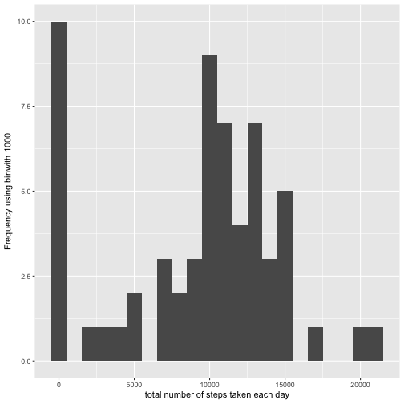
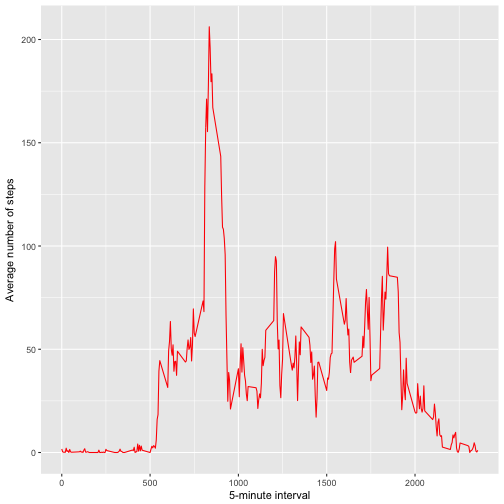
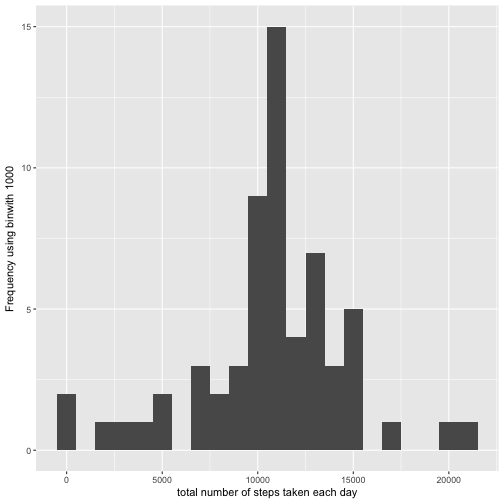
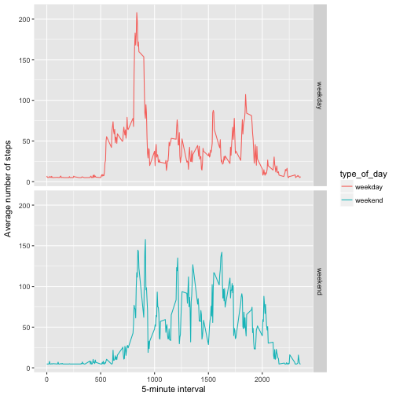

#Reproducible Research: Peer Assessment 1  


## Loading and preprocessing the data  

### 1. Code for reading in the dataset and/or processing the data  

```r
if(!file.exists('activity.csv')){
    unzip(zipfile="activity.zip")
}
data <- read.csv("activity.csv")
#Get the date field as Date
data$date <- as.Date(data$date, format="%Y-%m-%d")
```


## What is mean total number of steps taken per day? 

### 2. Histogram of the total number of steps taken each day

```r
library(ggplot2)
```

```
## Find out what's changed in ggplot2 at
## http://github.com/tidyverse/ggplot2/releases.
```

```r
library(dplyr)
```

```
## 
## Attaching package: 'dplyr'
```

```
## The following objects are masked from 'package:stats':
## 
##     filter, lag
```

```
## The following objects are masked from 'package:base':
## 
##     intersect, setdiff, setequal, union
```

```r
sums_byday <- summarise(group_by(data, date), total_steps = sum(steps, na.rm = TRUE))
qplot(sums_byday$total_steps, binwidth=1000, xlab="total number of steps taken each day", ylab="Frequency using binwith 1000")
```



### 3. Mean and median number of steps taken each day  

```r
mean(sums_byday$total_steps)
```

```
## [1] 9354.23
```

```r
median(sums_byday$total_steps)
```

```
## [1] 10395
```


## What is the average daily activity pattern?  

### 4. Time series plot of the average number of steps taken

```r
avg_byint <- summarise(group_by(data, interval), avg_steps = mean(steps, na.rm = TRUE))
ggplot(data = avg_byint, aes(x = interval, y = avg_steps)) + 
  xlab("5-minute interval") + 
  ylab("Average number of steps") + 
  geom_line(colour="red") 
```



### 5. The 5-minute interval that, on average, contains the maximum number of steps

```r
maxsteps_record <- avg_byint %>% filter(avg_steps >= round(max(avg_byint$avg_steps)))
maxsteps_record$interval
```

```
## [1] 835
```


## Imputing missing values

### 6. Code to describe and show a strategy for imputing missing data  

Hmisc is a multiple purpose package useful for data analysis, high – level graphics, imputing missing values, advanced table making, model fitting & diagnostics (linear regression, logistic regression & cox regression) etc. Amidst, the wide range of functions contained in this package, it offers 2 powerful functions for imputing missing values. These are impute() and aregImpute(). 

impute() function simply imputes missing value using user defined statistical method (mean, max, median). It’s default is median. On the other hand, aregImpute() allows mean imputation using additive regression, bootstrapping, and predictive mean matching.

```r
library(Hmisc)
```

```
## Loading required package: lattice
```

```
## Loading required package: survival
```

```
## Loading required package: Formula
```

```
## 
## Attaching package: 'Hmisc'
```

```
## The following objects are masked from 'package:dplyr':
## 
##     src, summarize
```

```
## The following objects are masked from 'package:base':
## 
##     format.pval, units
```

Missing values in data set:

```r
#Coping original data set to imputed_data
imputed_data <- data
sum(is.na(imputed_data$steps))
```

```
## [1] 2304
```

Imputing na values:

```r
imputed_data$steps <- impute(data$steps,fun=mean)
```

Missing values after impute call:

```r
sum(is.na(imputed_data$steps))
```

```
## [1] 0
```

### 7. Histogram of the total number of steps taken each day after missing values are imputed

```r
imputed_sums_byday <- summarise(group_by(imputed_data, date), total_steps = sum(steps, na.rm = TRUE))
qplot(imputed_sums_byday$total_steps, binwidth=1000, xlab="total number of steps taken each day", ylab="Frequency using binwith 1000")
```



Mean and median number of steps taken each day:  

```r
mean(imputed_sums_byday$total_steps)
```

```
## [1] 10766.19
```

```r
median(imputed_sums_byday$total_steps)
```

```
## [1] 10766.19
```

## Are there differences in activity patterns between weekdays and weekends?

### 8. Panel plot comparing the average number of steps taken per 5-minute interval across weekdays and weekends


```r
#New field 'type_of_day' to store if it is weekend or weekday
imputed_data['type_of_day'] <- weekdays(imputed_data$date)
imputed_data$type_of_day[imputed_data$type_of_day  %in% c('Saturday','Sunday') ] <- "weekend"
imputed_data$type_of_day[imputed_data$type_of_day != "weekend"] <- "weekday"
imputed_avg_byint <- summarise(group_by(imputed_data, type_of_day, interval), avg_steps = mean(steps, na.rm = TRUE))
ggplot(data = imputed_avg_byint, aes(x = interval, y = avg_steps)) + 
  geom_line(stat = "identity", aes(colour = type_of_day)) + 
  facet_grid(type_of_day ~ ., scales="fixed", space="fixed") + 
  labs(x="5-minute interval", y=expression("Average number of steps")) 
```


